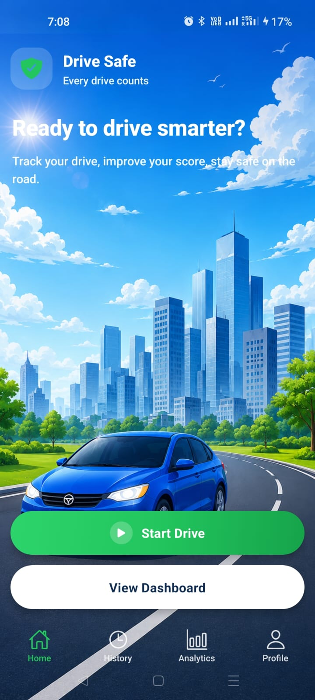
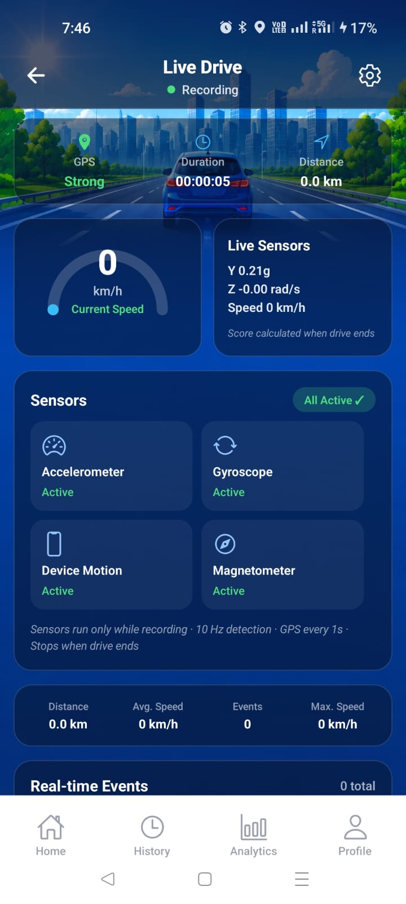
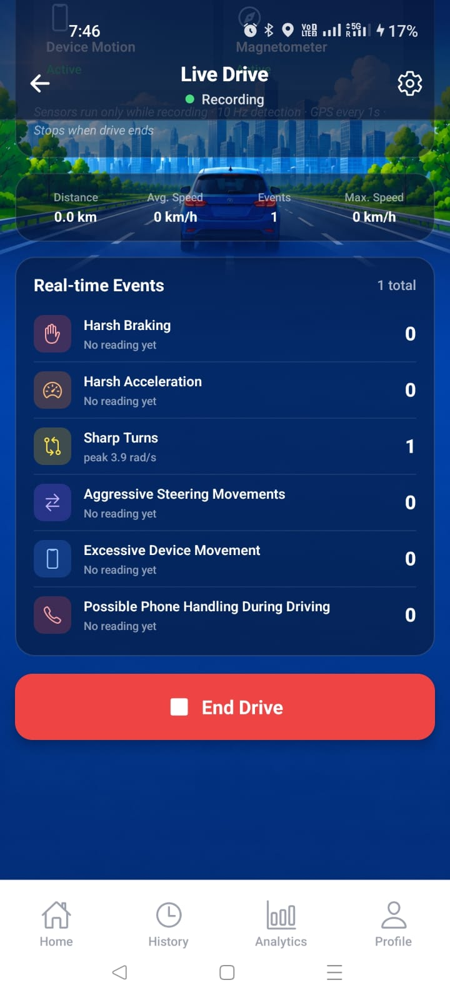
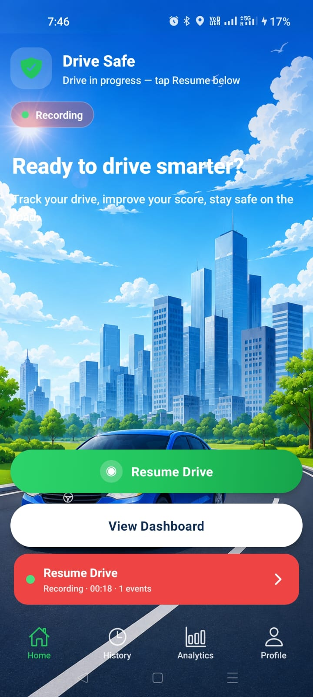
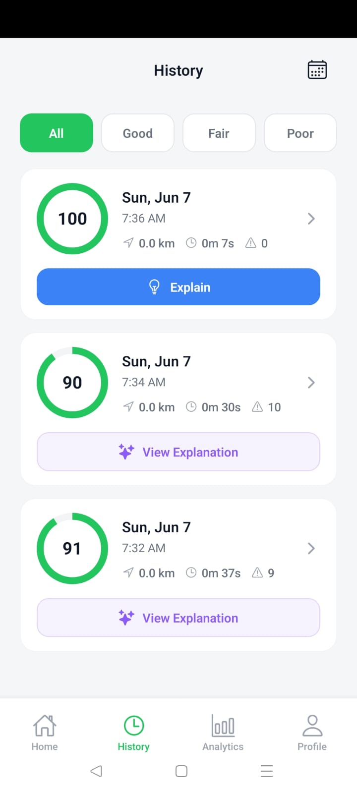
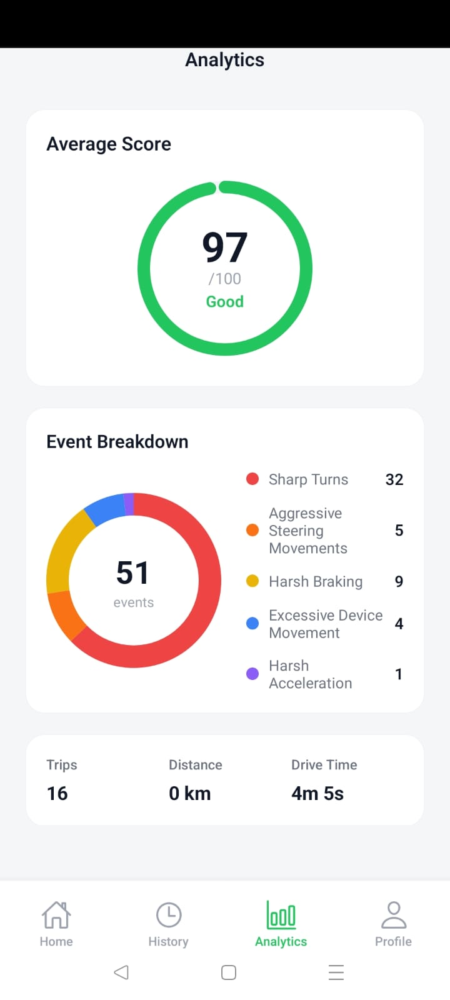
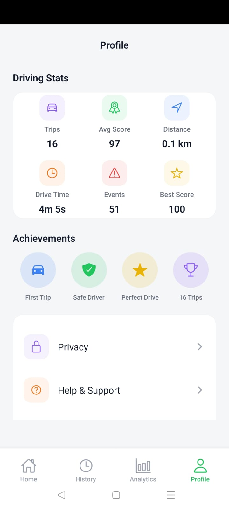

# SafeDrive

SafeDrive is a mobile driving safety app built with Expo and React Native. It uses **phone sensors** (not direct vehicle telemetry) to detect risky driving patterns, calculate a driving score, save trip history, and generate **AI-powered feedback** with historical comparison.

## Project Overview

The app records a drive session while you are on the road. Phone motion is sampled in real time and compared against fixed thresholds. When a threshold is crossed, an event is logged (for example harsh braking or a sharp turn). At the end of the drive, the final score is calculated and saved. You can review past trips in History, see trends in Analytics, and tap **Explain** on any trip for Gemini-generated coaching feedback with personalized suggestions.

Core idea:

```
Phone Sensors → Phone Motion → Inferred Driving Event → Score + History + AI Feedback
```

Main screens:

- **Home** — start or resume a drive
- **Live Drive** — real-time speed, sensor status, and event counts
- **Drive Summary** — score, event breakdown, and Explain button
- **History** — past trips with filters (Good / Fair / Poor)
- **Analytics** — average score and event trends across all drives
- **Explain** — AI-generated driving feedback with historical comparison and tips

## Tech Stack

| Layer | Technology |
|-------|------------|
| Framework | Expo SDK 55, React Native 0.83, React 19 |
| Language | TypeScript |
| Navigation | Expo Router (file-based routes) |
| State | React Context (`DriveContext`, `AuthContext`) |
| Sensors | `expo-sensors` (accelerometer, gyroscope, device motion, magnetometer) |
| Location | `expo-location` (speed, distance) |
| Database | `expo-sqlite` (drive sessions, events, sensor summaries, AI feedback) |
| AI Coach | Google Gemini API (`generateContent`) |
| UI | `react-native-svg`, `expo-linear-gradient` |
| Package manager | Bun |

## Sensors Used

| Sensor | Role in SafeDrive |
|--------|-------------------|
| **Accelerometer** | Detects forward braking/acceleration (Y-axis) and excessive phone movement (X/Y axes) |
| **Gyroscope** | Detects sharp turns via yaw rate (Z-axis) |
| **Device Motion** | Provides pitch and roll for phone-handling detection |
| **GPS (Location)** | Speed (km/h) and distance travelled; required for phone-handling logic |
| **Magnetometer** | Optional; logged when available on the device |

Sensors run **only during an active drive**:

- Sampling: **100 ms** (10 Hz) for event detection
- Live dashboard text refresh: **500 ms** (reduces UI re-renders)
- GPS updates: about **1 second**, minimum **5 m** movement
- All subscriptions are stopped when the drive ends or the app unmounts

## Event Detection Strategy

Each sensor reading is passed to `EventDetector`, which runs six independent checks. Each event type has a **cooldown** (2–5 seconds) so one physical action does not create many duplicate events.

| Event | Meaning | Primary input |
|-------|---------|---------------|
| Harsh Braking | Sudden deceleration; phone lurches forward | Accelerometer Y < threshold |
| Harsh Acceleration | Sudden acceleration; phone pushes back | Accelerometer Y > threshold |
| Sharp Turn | Quick rotation | \|Gyroscope Z\| > threshold |
| Aggressive Steering | Zig-zag pattern: 3+ sharp turns within 5 s | Sharp-turn counter |
| Excessive Movement | Phone shaken, dropped, or picked up | \|Accel X\| or \|Accel Y\| spike |
| Phone Handling | Phone rotated while vehicle is moving | Speed + orientation change + movement spike |

**Excessive movement** is skipped on the same reading if harsh brake or acceleration already fired (avoids double-counting vehicle motion).

**Phone handling** requires all three:

1. Speed ≥ 15 km/h  
2. Orientation change ≥ 30° within 2 seconds  
3. Accelerometer axis spike > 5  

## Threshold Values

All values are defined in `src/constants/thresholds.ts`.

| Setting | Value | Unit / Notes |
|---------|-------|----------------|
| `harshBrake` | **-3.5** | g (accelerometer Y) |
| `harshAcceleration` | **+3.5** | g (accelerometer Y) |
| `sharpTurn` | **2.0** | rad/s (gyroscope Z) |
| `aggressiveSteeringTurns` | **3** | turns in window |
| `aggressiveSteeringWindowMs` | **5000** | ms |
| `excessiveMovementAxis` | **5.0** | g (accel X or Y) |
| `phoneOrientationChangeDeg` | **30** | degrees |
| `phoneOrientationWindowMs` | **2000** | ms |
| `phoneHandlingMinSpeedKmh` | **15** | km/h |
| `sensorIntervalMs` | **100** | ms (10 Hz detection) |
| `sensorUiRefreshMs` | **500** | ms (dashboard display) |

**Cooldowns (per event type):**

| Event | Cooldown |
|-------|----------|
| Harsh brake / acceleration | 3 s |
| Sharp turn | 2 s |
| Aggressive steering | 5 s |
| Excessive movement / phone handling | 3 s |

## Driving Score Calculation

**Formula:**

```
Final Score = 100 − Total Events
```

- Starting score: **100**
- Each detected event costs **1 point** (flat penalty, same for every event type)
- Minimum score: **0**
- Severity values are stored for display but do **not** change the penalty

**Safety rating** (after drive ends):

| Score | Rating |
|-------|--------|
| 80 – 100 | Good |
| 60 – 79 | Fair |
| 0 – 59 | Poor |

The live dashboard shows **event counts in real time**. The **final score** is calculated when you tap **End Drive**.

Implementation: `src/services/scoring/ScoreEngine.ts`

## AI Explain (Gemini)

After a drive, tap **Explain** to get structured feedback:

1. **Driving Feedback** — summary of the trip  
2. **Historical Comparison** — vs your previous drives (score, events, distance)  
3. **Suggestions** — three numbered, actionable tips  

Requires a Gemini API key in `.env` (see below). Responses are cached in SQLite per session.

## How to Run Locally

### Requirements

- Node.js 20+
- [Bun](https://bun.sh)
- [Expo Go](https://expo.dev/go) SDK 55 on a physical phone (recommended for real sensors)
- Android or iOS device with motion and location permissions

### Setup

```bash
git clone https://github.com/Abrargit25/SafeDrive.git
cd SafeDrive
bun install
```

Create a local environment file from the template:

```bash
cp .env.example .env
```

Set your Gemini API key in `.env`:

```env
EXPO_PUBLIC_AI_COACH_API_URL=https://generativelanguage.googleapis.com/v1beta/models/gemini-flash-latest:generateContent
EXPO_PUBLIC_AI_MODEL=gemini-flash-latest
GEMINI_API_KEY=your-gemini-api-key-here
```

### Start the app

```bash
bun run start
```

Or with a cleared Metro cache (needed after changing `.env`):

```bash
bun run start -- --clear
```

Scan the QR code with Expo Go. Grant **location** and **motion** permissions when prompted.

**Other scripts:**

| Command | Purpose |
|---------|---------|
| `bun run start:lan` | LAN mode (same Wi‑Fi, no tunnel) |
| `bun run android` | Run on Android device/emulator |
| `bun run web` | Web preview (limited sensor support) |

### Quick test flow

1. Open app → register and complete OTP verification  
2. Tap **Start Drive** on Home  
3. Move the phone or take a short trip with the device mounted  
4. Tap **End Drive** → view summary and score  
5. Open **History** → tap **Explain** for AI feedback  

## Assumptions

1. **The phone is mounted in a stable position** in the vehicle (holder, mount, or dashboard). Detection maps phone motion to vehicle behaviour; a loose phone will produce noisier readings.

2. **Driving events are inferred from smartphone sensors** (accelerometer, gyroscope, device motion, GPS) rather than direct OBD or CAN bus data — the same approach used by many insurance telematics and driver-safety apps when only a phone is available.

3. **One event = one point**, regardless of how far above the threshold the reading was. This keeps scoring simple and predictable.

4. **GPS speed** is used for phone-handling detection and distance; accuracy depends on device and environment.

5. **AI Explain** requires network access and a valid `GEMINI_API_KEY`. Without it, a local text summary is shown instead.

6. **Auth is a demo flow** (name + phone + OTP) for navigation only; no real backend authentication.

## Project Structure

```
src/
├── app/                    # Expo Router screens (routes)
├── components/             # Reusable UI components
├── features/
│   ├── auth/store/         # AuthContext
│   └── drive/
│       ├── store/          # DriveContext
│       └── services/       # EventDetector
├── services/
│   ├── sensors/            # SensorManager + sensor wrappers
│   ├── detection/          # Per-event detector classes
│   ├── scoring/            # ScoreEngine, RatingEngine
│   ├── ai/                 # Gemini drive coach
│   └── storage/            # SessionStorage (SQLite)
├── db/databasehelper/      # SQLite schema and CRUD helpers
├── constants/thresholds.ts # All detection thresholds
└── config/ai.ts            # Gemini API configuration
```

## Data Pipeline: Sensor → UI → End Drive → SQLite

```
expo-sensors (100 ms) + expo-location (1 s)
        ↓
SensorManager merges accel / gyro / motion / mag into one SensorSnapshot
        ↓
EventDetector.check(snapshot) — threshold checks + cooldowns
        ↓
DriveContext.pushEvents() — appends to in-memory active session
        ↓
Live Drive UI reads DriveContext (speed, readings, eventCounts) — UI refresh every 500 ms
        ↓
End Drive → ScoreEngine.calculate() → RatingEngine → saveSession()
        ↓
SQLite: drive_sessions, drive_events, sensor_summary, ai_feedback
        ↓
History / Analytics / Explain load from SQLite via databasehelper
```

**During a drive:** `SensorManager` samples at **10 Hz**. Each snapshot is passed to `EventDetector` with the latest GPS speed. New events are stored in React state (`DriveContext.active.events`). The dashboard subscribes to context — sensor text updates every **500 ms** to limit re-renders; event counts update as events arrive.

**On End Drive:** `Score = max(0, 100 − eventCount)`. Session metadata (max/avg speed, distance, rating, sensor averages) is written to SQLite through `SessionStorage` → `saveCompletedDrive()`. History and Analytics reload from the database; Explain fetches or generates AI text and caches it in `ai_feedback`.

**Distance formula** (Haversine between GPS points):

```
a = sin²(Δlat/2) + cos(lat₁)·cos(lat₂)·sin²(Δlon/2)
distance = 6371000 × 2 × atan2(√a, √(1−a))   // meters
```

## Event Detection Formulas

Each event fires when its condition is true **and** the per-type cooldown has elapsed. **Severity** is stored for display only; scoring always deducts **1 point** per event.

| Event | Trigger formula | Severity (display) |
|-------|-----------------|-------------------|
| **Harsh braking** | `accelY < −3.5 g` | `max(0, −3.5 − accelY)` |
| **Harsh acceleration** | `accelY > +3.5 g` | `max(0, accelY − 3.5)` |
| **Sharp turn** | `\|gyroZ\| > 2.0 rad/s` | `max(0, \|gyroZ\| − 2.0)` |
| **Aggressive steering** | `≥ 3 sharp turns within 5 s` | `max(0, turnCount − 2)` |
| **Excessive movement** | `\|accelX\| > 5 g` **or** `\|accelY\| > 5 g` (skipped if brake/accel fired same tick) | `max(0, max(\|accelX\|, \|accelY\|) − 5)` |
| **Phone handling** | `speed ≥ 15 km/h` **and** (`\|accelX\| > 5` or `\|accelY\| > 5`) **and** `max(\|Δpitch\|, \|Δroll\|) > 30°` within 2 s | `max(0, orientationDelta° − 30)` |

**Final score:** `Score = max(0, 100 − totalEvents)` → rating: Good (80+), Fair (60–79), Poor (&lt;60).

## Screens & How They Were Built

### Home



Built with `HomeLanding` — a full-screen cover image (`HomeScreenBackgroundImg1.png`) positioned with `getAdaptiveCoverLayout`, a top `LinearGradient` fade, and glass-style action buttons. Data comes from `DriveContext.isDriving`; tapping **Start Drive** calls `startDrive()` which starts sensors and GPS, then navigates to Live Drive. No SQLite reads on this screen — it only triggers the pipeline.

### Live Drive




Built with `LiveDriveDashboard` — same immersive background pattern as Home, glass panels (`GlassPanel`), SVG speed arc, and a 2×3 event grid. All values are live from `DriveContext`: `speedKmh`, `elapsedMs`, `readings` (accel/gyro strings), `eventCounts`, and `gpsStatus`. Events increment in real time as `EventDetector` fires; the score is **not** shown live — only counts update until End Drive.

### Resume Drive (active session)



Same `HomeLanding` component; when `isDriving` is true the primary button switches to **Resume Drive** and a recording badge appears. State persists in `DriveContext.active` in memory — sensors keep running if you left mid-drive. Tapping Resume navigates back to `/(tabs)/drive` without creating a new SQLite session.

### History



Built with `ScreenContainer` + `HistoryRow` list. On focus, `refreshHistory()` loads all completed sessions from SQLite via `loadDriveSessions()`. Filter chips (All / Good / Fair / Poor) filter client-side by `score`. Each row shows date, score, distance, and duration; **Explain** opens `ai-insight` with the session id; tapping the row calls `openHistorySession()` to reload that trip into `completed` and open Drive Summary.

### Analytics



Built with `ScreenContainer`, `ScoreRing`, `EventChart`, and `StatGrid`. All stats are computed in a `useMemo` over `history` from context (SQLite-backed): `avgScore = round(Σ scores / n)`, total events, total distance, and drive time. The donut chart groups events by type across all trips — no new sensor reads; purely aggregated SQL data.

### Profile



Built with `UserCard`, `AchievementBadge`, `StatGrid`, and `MenuRow` inside `ScreenContainer`. Trip stats (total drives, avg score, total distance, best score) are derived from `history` in `useMemo`. Refreshes history on tab focus. Sign-out clears `AuthContext` only — drive data stays in SQLite.

### Drive Summary

Shown after **End Drive** (`drive-summary.tsx`). Uses `ScoreRing`, `EventChart`, and per-event peak values from the just-finished session in `DriveContext.completed`. Score is computed once: `100 − events.length`. Data is already saved to SQLite before this screen renders; **Explain** navigates to the AI insight screen with the session id.

### Explain (AI)

`ai-insight.tsx` loads cached feedback from SQLite `ai_feedback` or calls Gemini with trip stats + historical deltas. Structured output has three sections: Driving Feedback, Historical Comparison (`Δscore`, `Δevents`, `Δdistance` vs prior drives), and three numbered Suggestions. Falls back to a local template if `GEMINI_API_KEY` is missing.

## Screenshots

All captures live in `screenShots/`:

| Screen | File |
|--------|------|
| Home | `HomePage.png` |
| Live Drive (dashboard) | `LiveDrive1.png` |
| Live Drive (events) | `LiveDrive2.png` |
| Resume active drive | `ResumeDriveButton.png` |
| History | `HistoryPage.png` |
| Analytics | `Analytics.png` |
| Profile | `Profile.png` |

## Links

| Resource | URL |
|----------|-----|
| Repository | [github.com/Abrargit25/SafeDrive](https://github.com/Abrargit25/SafeDrive) |
| Demo video | [Watch on Google Drive](https://drive.google.com/file/d/1J1WnPyeMOcPAVBg2cBYnp8RFHYPaDMVU/view?usp=sharing) |


## Features

| Capability | Implementation |
|------------|----------------|
| Start / End Drive | `DriveContext.startDrive()` / `endDrive()` |
| Sensor collection | `SensorManager` — 100 ms sampling, stops on end/unmount |
| Accelerometer | Harsh brake, harsh acceleration, excessive movement |
| Gyroscope | Sharp turn, aggressive steering |
| Device Motion | Pitch/roll for phone-handling detection |
| Magnetometer | Subscribed when available on device |
| Real-time events | `EventDetector.check()` on every sensor snapshot |
| Driving score | `ScoreEngine` — `100 − event count` |
| Session summary | `drive-summary.tsx` after End Drive |
| Live dashboard | Duration, total events, per-type breakdown |
| AI coaching | Gemini **Explain** with historical comparison |
| Analytics | Average score and event trends across all drives |

Each detected event deducts **1 point** from the starting score of 100. Severity values are stored for display only. Event counts update live during a drive; the final score and safety rating appear on the Drive Summary after End Drive.

## Core Implementation Files

```
src/services/sensors/SensorManager.ts
src/features/drive/services/EventDetector.ts
src/constants/thresholds.ts
src/features/drive/store/DriveContext.tsx
src/services/scoring/ScoreEngine.ts
```